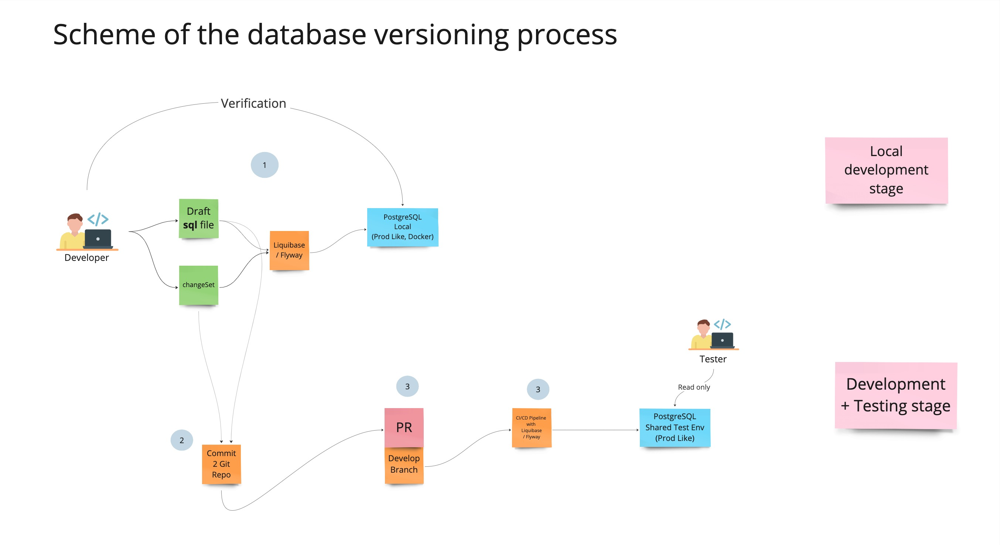

# Versioning of database structures


## Systems under consideration
 - [Liquibase](https://www.liquibase.org)
 - [FlyWay](http://flywaydb.org)

## The process
Формат хранениея изменений - SQL



## Startup and shutdown

### Start/Stop DB
```bash
# Start
docker compose up

# Shutdown
docker compose down
```
### Liquibase
```bash
liquibase update
```
 

## License 
[](https://opensource.org/licenses/MIT)
